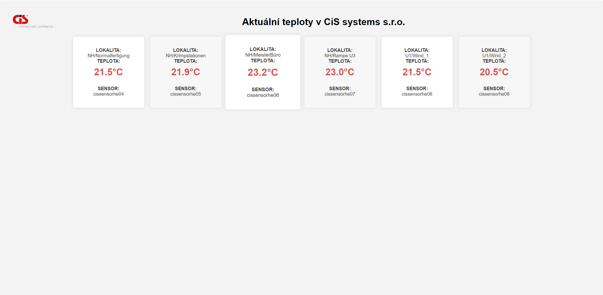

# WAP - projekt | načtení dat pomocí API Zabbixu

Jednoduchý use-case v Pythonu pro načtení dat pomocí API Zabbixu a jejich výpis.

Zabbix slouží pro monitoring, jedná se o opensource projekt. U nás ve firmě vznikla potřeba vytvořit monitoring teplotních údajů ve výrobních halách z důvodu stížností zaměstnanců, teplotní data sbírá Zabbix a pomocí API máme možnost promítnout tato data zaměstnancům bez nutnosti vytváření účtu v Zabbixu, atp.

V podstatě Python script tato data načte a vrátí jejich hodnotu, k ověření dojde pouze pomocí API klíče, to stejné se děje u .PHP projektu, s kterým mi pomohl kolega a vytvořili jsme tak jednoduchou webovku, která zobrazí aktuální teploty z daných sensorů.

## Soubory projektu

### 1. `index.php`

Načte potřebné údaje pomocí API, poté je zobrazí v přehledném zobrazení. Byl použit podobný design jako u Atlas hub.

### 2. `zabbix_api_read.py`

V rámci mého seznamování se s Pythonem jsem si vyzkoušel podobnou funkcni v tomto programovacím jazyku, v podstatě se jednalo o vyzkoušení Zabbix API a potvrzení funkčnosti.

## Náhled

