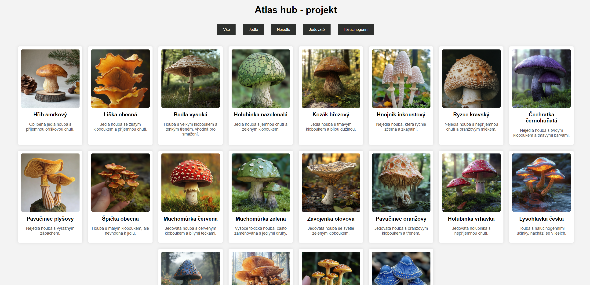

# Atlas hub - projekt

Jednoduchá webová aplikace pro prohlížení atlasu hub. Umožňuje filtrování hub podle kategorií (jedlé, nejedlé, jedovaté, halucinogenní) a jejich zobrazení v přehledné galerii.

## Soubory projektu

### 1. `index.html`
Obsahuje hlavní strukturu webové stránky:
- Nadpis
- Filtry pro výběr kategorií hub
- Sekci galerie pro zobrazení hub
- Připojení externích souborů `style.css` a `script.js`.

### 2. `style.css`
Styly pro vzhled aplikace:
- Definice barev, fontů a rozvržení.
- Stylizace tlačítek filtrů, galerie a jednotlivých položek.
- Efekty na hover a přechody pro plynulé animace.

### 3. `script.js`
JavaScript pro dynamické načítání dat:
- Funkce `fetchMushrooms(category)` načítá data z PHP skriptu dle vybrané kategorie.
- Zpracování dat a zobrazení v galerii.
- Ošetření chyb při načítání.

### 4. `fetch_mushrooms.php`
PHP skript, který slouží k získání dat o houbách z databáze:
- Přijímá parametr `category` pro filtrování dat.
- Vrací JSON odpověď obsahující seznam hub.

## Možnosti atlasu

- **Filtrování hub podle kategorií**: Jedlé, nejedlé, jedovaté, halucinogenní.
- **Galerie hub**: Každá houba obsahuje obrázek, název a popis.
- **Responsivní design**: Optimalizováno pro různá zařízení.

## Náhled

